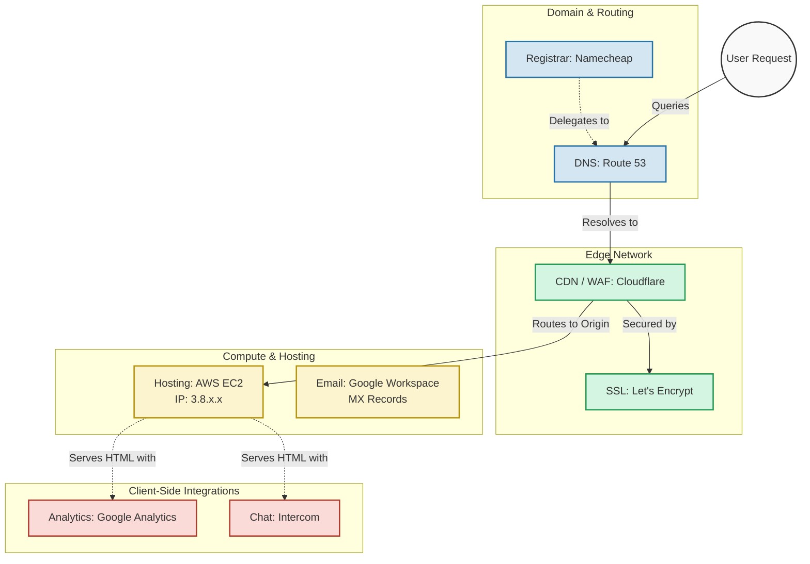

# CloudTracer

CloudTracer scans a website and tells you all the cloud providers that it uses including domain name registration, DNS, CDN, hosting, etc. It is operated from the command line or from a website.

## Implementation plan

1. Create npm package placeholders and reserve the package name: cloudtracer
2. Build a CLI tool and test locally
3. Make the CLI tool work as "npx cloudtracer"
4. Create a Chrome Extension that perfomrs the same thing on the current web domain when clicked

## Implementation details

### **Target Scan Categories & Data Sources**

To provide a complete picture of a website’s cloud footprint, the scanner needs to analyze the network layers from the outside in. Here is the breakdown of what to scan for and where to get that data:

| Infrastructure Layer | What We Scan For | Primary Data Sources & Methods |
| :--- | :--- | :--- |
| **Domain Registration** | Registrar, Registration Date, Expiration Date. | **RDAP** (Registration Data Access Protocol) API; fallback to traditional **WHOIS** queries. |
| **DNS (Domain Name System)** | Authoritative Nameservers, DNS Hosting Provider (e.g., Route53, Cloudflare). | **DNS `NS` Records**. Cross-reference nameserver domains with known provider lists. |
| **CDN & WAF** | Content Delivery Network, Web Application Firewall, Edge computing. | **HTTP Headers** (e.g., `Server`, `Via`, `X-Cache`, `CF-Ray`); **DNS `CNAME` Records**; IP address matching against known CDN CIDR blocks. |
| **Hosting & Compute** | Underlying Cloud Provider (AWS, GCP, Azure, DigitalOcean), IP Geolocation. | **DNS `A`/`AAAA` Records** resolved to IP addresses. Map IPs using **ASN (Autonomous System Number) / BGP databases** (like MaxMind or Routeviews) to identify the network owner. |
| **SSL/TLS Certificates** | Certificate Authority (e.g., Let's Encrypt, DigiCert), Expiration, Validity. | **TLS Handshake** extraction. Read the x.509 certificate chain for the `Issuer` and `Subject Alternative Name` (SAN) fields. |
| **Email Infrastructure** | Email service providers (Google Workspace, Office 365, SendGrid). | **DNS `MX` Records** (for receiving); **DNS `TXT` Records** (specifically SPF, DKIM, DMARC policies for sending). |
| **Third-Party Services** | Analytics, trackers, customer support widgets, marketing pixels. | **HTML/DOM Parsing** of the live page. Regex matching on `<script>` `src` tags and network payload requests. |

-----

### **Data Formatting & Presentation Guidelines**

How the data is presented depends entirely on the interface. Here is a brief guide on how to format the output for different mediums.

#### **Command Line Interface (CLI)**

  * **Default Output:** Use a structured, color-coded tree or tabular layout. Focus on speed and readability. Use terminal colors (e.g., Green for secure/active, Yellow for warnings like expiring SSL).

  * **Machine-Readable Output:** Always include a `--json` or `--yaml` flag. This is critical for developers who want to pipe the output into other tools (like `jq`) or CI/CD pipelines.

  * **Example format:** \`\`\`text
    $ cloudreveal scan example.com

    🌐 example.com
    ├── Registrar : MarkMonitor Inc.
    ├── DNS       : Amazon Route 53 (awsdns.com)
    ├── CDN       : Fastly (Header: x-fastly-request-id)
    ├── Hosting   : Google Cloud Platform (ASN: 15169)
    └── Mail      : Google Workspace (https://www.google.com/search?q=aspmx.l.google.com)

    ```

    ```

#### **Website / Web App**

  * **Visual Architecture:** Use a card-based dashboard layout. Group findings into logical categories (Security, Performance, Hosting).
  * **Interactivity:** Provide clickable tooltips explaining *how* the scanner reached its conclusion (e.g., "We know this is AWS because IP 192.0.2.1 belongs to ASN 16509").
  * **Historical Data:** Websites change. The web interface should feature a timeline view, showing when a site migrated from one provider (e.g., Heroku) to another (e.g., AWS).

#### **Markdown Output (For Reports/Documentation)**

  * **Structure:** Use standard markdown headings (`##`) for each category, bullet points for lists of records, and tables for IP/ASN data.
  * **Visuals:** Use **Mermaid.js** to automatically generate an infrastructure flowchart that makes the data instantly comprehensible.

-----

### **Markdown Mermaid Diagram Implementation**

When generating a Markdown report, the tool should compile the findings into a Mermaid flowchart. This maps the journey of a user's request through the discovered infrastructure stack.

Here is what the generated Mermaid code would look like for a hypothetical scan of a modern web app:


